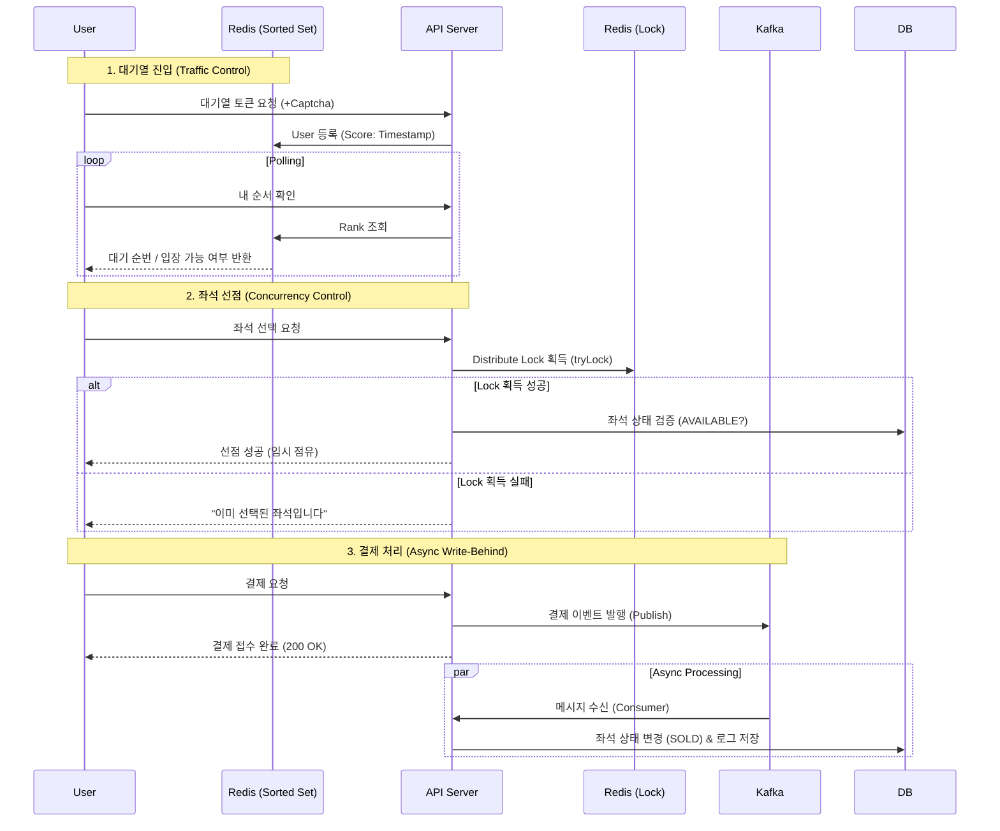

# 🎫 High-Concurrency Concert Ticketing System
> **대규모 트래픽 환경**에서도 데이터 정합성을 보장하고 안정적으로 예매를 처리하는 **콘서트 티켓팅 서비스**입니다.

[](https://www.java.com/)
[](https://spring.io/projects/spring-boot)
[](https://redis.io/)
[](https://kafka.apache.org/)
[](https://www.mysql.com/)
[](https://www.docker.com/)

## 📖 Project Overview
인기 콘서트 티켓팅 시 발생하는 **트래픽 폭주(Traffic Spike)** 와 **좌석 중복 결제(Race Condition)** 문제를 기술적으로 해결하는 데 초점을 맞춘 프로젝트입니다.
실제 서비스와 유사한 환경을 구축하기 위해 **대기열 시스템, 캡차(Captcha) 인증, 비동기 결제 처리**를 구현하였으며, **JMeter**를 이용한 부하 테스트를 통해 시스템 안정성을 검증했습니다.

## 🏗 System Architecture
**Redis**를 활용해 트래픽을 제어하고, **Kafka**를 통해 결제 트랜잭션을 비동기로 처리하여 DB 부하를 최소화하는 아키텍처입니다.


## 🔥 Key Technical Challenges & Solutions
1. 트래픽 제어를 위한 대기열 시스템 (Waiting Queue)
   문제 상황: 티켓 오픈 직후 수만 건의 요청이 DB로 직접 유입될 경우 Connection Pool 고갈 및 서버 다운 위험.

해결 방법: Redis Sorted Set을 이용한 대기열 구현.

UserId를 Value, 접속시간을 Score로 저장하여 선착순 입장 보장.

Scheduler가 1초마다 정해진 인원(N)만큼 입장 토큰(Active Key)을 부여하는 유량 제어(Flow Control) 적용.

결과: DB가 감당 가능한 수준으로 트래픽을 일정하게 유지.

2. 동시성 이슈 해결 (Redis Distributed Lock)
   문제 상황: User A와 User B가 동시에 같은 좌석을 선택할 경우, 중복 예매가 발생하는 Race Condition.

해결 방법: Redisson 분산 락 도입.

tryLock(waitTime=0, leaseTime=5min) 전략 사용: 대기 없이 즉시 실패 처리(Fast-Fail)하여 사용자 경험 최적화.

Double Check: 락 획득 후 DB 상태를 한 번 더 검증하고, 요청된 콘서트 ID와 실제 좌석의 콘서트 ID를 비교하는 로직 추가로 데이터 무결성 강화.

3. 결제 성능 최적화 (Kafka Write-Behind)
   문제 상황: 결제 로직이 복잡해질수록 DB 트랜잭션 시간이 길어져, 사용자 응답 지연 및 스레드 블로킹 발생.

해결 방법: Kafka를 이용한 비동기 처리.

사용자의 결제 요청을 받으면 즉시 Kafka Topic에 이벤트를 발행하고 응답 반환.

별도의 Consumer Group이 백그라운드에서 DB 상태 변경(SOLD)을 수행.

결과: 사용자 대기 시간을 획기적으로 단축하고 시스템 처리량(TPS) 향상.

## 📊 Performance Testing (JMeter)
테스트 시나리오: 좌석 500개인 콘서트에 1,000명의 유저가 동시 접속.

Queue: 1,000명 전원 대기열 진입 확인.

Concurrency: 동일 좌석 동시 요청 시 1명만 성공, 나머지는 409 Conflict 반환.

Result:

최종 DB 조회 시 정확히 500개의 좌석만 판매됨 (Overbooking 0건).

타 콘서트(ID: 2) 좌석 예매 시도 시 예외 처리 동작 확인.

(여기에 JMeter 결과 그래프나 Summary Report 스크린샷을 넣으면 좋습니다)

## 🛠 Tech Stack
Back-end: Java 17, Spring Boot 3.4

Database: MySQL 8.0 (JPA/Hibernate)

Cache & Lock: Redis (Redisson)

Message Broker: Apache Kafka

Infrastructure: Docker, Docker Compose

Monitoring: Prometheus, Grafana

Testing: JMeter

Front-end: Thymeleaf, Bootstrap 5

## 🚀 How to Run
이 프로젝트는 Docker Compose를 통해 모든 인프라를 한 번에 실행할 수 있습니다.

1. Prerequisites Docker & Docker Compose 설치

2. Installation & Run 

``` shell
# 1. 프로젝트 클론
git clone [https://github.com/your-username/ticketing-system.git](https://github.com/your-username/ticketing-system.git)

# 2. 프로젝트 빌드 및 실행 (DB, Redis, Kafka 포함)
docker-compose up -d --build

# 3. 로그 확인 (Spring Boot가 완전히 켜질 때까지 대기)
docker logs -f ticketing-app
```

3. Access <br> 
<li> Client Main: http://localhost:8083/concerts

<li> Admin Dashboard: http://localhost:8083/admin/dashboard

<li> Grafana: http://localhost:3000

📂 Project Structure
```
src/main/java/com/dev/ticketing_system
├── config          # Kafka, Redis, Web 설정
├── controller      # Admin/Client Controller
├── service         # Queue, Seat, Payment Service (핵심 로직)
├── repository      # JPA Repository
├── entity          # Concert, Seat Entity
├── consumer        # Kafka Consumer
├── scheduler       # 대기열 관리 스케줄러
└── exception       # Global Exception Handler
```