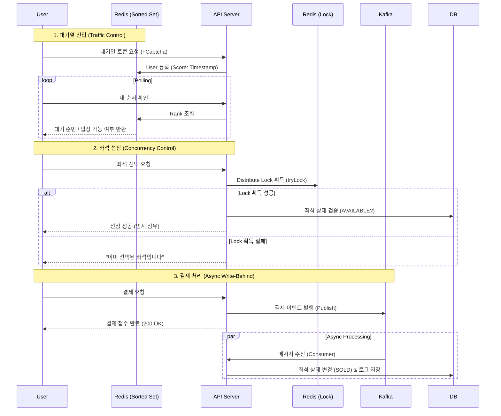

# High-Concurrency Concert Ticketing System
> **대규모 트래픽 환경(High Traffic)**을 고려한 안정적인 콘서트 티켓팅 서비스
>
> **Key Tech**: `Redis Distributed Lock`, `Waiting Queue`, `Kafka Async Processing`, `Idempotency`, `Rate Limiting`

[](https://www.oracle.com/java/)
[](https://spring.io/projects/spring-boot)
[](https://redis.io/)
[](https://kafka.apache.org/)
[](https://www.mysql.com/)
[](https://www.docker.com/)

---

## Project Overview
인기 콘서트 티켓팅 시 발생하는 **트래픽 폭주(Traffic Spike)**와 **좌석 중복 결제(Race Condition)** 문제를 기술적으로 해결하는 데 초점을 맞춘 프로젝트입니다.
실제 프로덕션 환경을 고려하여 **JVM 튜닝, 대기열 시스템, 멱등성 보장, 장애 복구(Fallback) 전략**을 적용하였으며, **JMeter**를 이용한 부하 테스트를 통해 시스템 안정성을 검증했습니다.

### 개발 기간
* **2026.01.07 ~ **

---

## Key Features

### User Service (Client)
* **대기열 시스템 (Waiting Queue)**: 접속자 폭주 시 Redis `Sorted Set`을 활용하여 순차 입장을 보장하며, 실시간으로 대기 순번과 예상 대기 시간을 안내합니다.
* **보안 인증 (Captcha)**: 매크로 및 비정상적인 접근을 차단하기 위해 대기열 진입 전 캡차(Captcha) 인증 과정을 거칩니다.
* **좌석 선점 및 결제**: 시각화된 좌석표에서 좌석을 선택하면 **Redisson 분산 락**이 실시간으로 중복 선택을 방지하며, **Kafka**를 통해 결제 트랜잭션을 비동기로 빠르고 안전하게 처리합니다.
* **공연 목록 조회 (Caching)**: Redis 기반의 **Global Caching**을 적용하여 조회 속도를 극대화했습니다.

### Admin Service (Manager)
* **실시간 대시보드 (Live Dashboard)**: 현재 대기 중인 인원, 실시간 티켓 판매율, 총 매출액 등 핵심 지표를 한눈에 모니터링할 수 있습니다.
* **공연 관리 (CMS)**: 새로운 공연을 등록하고 정보를 수정/삭제할 수 있으며, 공연 생성 시 수천 개의 좌석 데이터를 **Bulk Insert**로 즉시 생성합니다.
* **시스템 모니터링**: **Prometheus & Grafana**와 연동하여 서버의 리소스 상태 및 애플리케이션의 건강 상태를 시각화하여 관리합니다.

---

## System Architecture
**Redis**를 활용해 트래픽을 제어하고, **Kafka**를 통해 결제 트랜잭션을 비동기로 처리하여 DB 부하를 최소화하는 아키텍처입니다.



---

## 초기 예상되는 문제에 대한 예방 방안 

### 1. 트래픽 제어를 위한 대기열 시스템 (Waiting Queue)
* **문제 상황**: 티켓 오픈 직후 수만 건의 요청이 DB로 직접 유입될 경우 Connection Pool 고갈 및 서버 다운 위험.
* **해결 방법**: **Redis Sorted Set**을 이용한 대기열 구현.
    * Scheduler가 1초마다 정해진 인원(`N`)만큼 입장 토큰(`Active Key`)을 부여하는 **유량 제어(Flow Control)** 적용.
* **결과**: DB가 감당 가능한 수준으로 트래픽을 일정하게 유지.

### 2. 동시성 이슈 해결 (Redis Distributed Lock)
* **문제 상황**: `User A`와 `User B`가 동시에 같은 좌석을 선택할 경우, 중복 예매가 발생하는 **Race Condition**.
* **해결 방법**: **Redisson 분산 락** 도입.
    * `tryLock(waitTime=0, leaseTime=5min)` 전략 사용: 대기 없이 즉시 실패 처리(Fast-Fail).
    * **Double Check**: 락 획득 후 DB 상태 및 콘서트 ID 검증 로직을 추가하여 데이터 무결성 강화.

### 3. 결제 성능 최적화 (Kafka Write-Behind)
* **문제 상황**: 결제 로직의 트랜잭션이 길어질수록 DB 커넥션 점유 시간이 늘어나 처리량(TPS) 저하.
* **해결 방법**: **Kafka를 이용한 비동기 처리**.
    * 결제 요청 수신 즉시 이벤트 발행 후 응답 반환. 별도의 Consumer가 DB 상태 변경(`SOLD`) 수행.
* **결과**: 사용자 대기 시간 단축 및 시스템 처리량 대폭 향상.

---

## 시스템 안정성 및 운영 효율화

### 1. Container Awareness (JVM 튜닝)
* **적용**: Docker 컨테이너 환경에서 JVM이 호스트 메모리를 기준으로 힙을 과도하게 할당하여 **OOM Killer**에 의해 종료되는 문제를 방지.
* **설정**: `-XX:+UseContainerSupport -XX:MaxRAMPercentage=75.0` 옵션을 적용하여, 컨테이너 리소스 제한에 맞춰 유동적으로 힙 메모리를 관리하도록 구성.

### 2. 결제 안정성을 위한 멱등성(Idempotency) 보장
* **적용**: 네트워크 지연이나 타임아웃으로 인해 클라이언트가 결제 요청을 중복으로 보낼 경우를 대비.
* **구현**: 요청 헤더의 `Idempotency-Key`를 Redis에 저장하고 상태(`PROCESSING`, `COMPLETED`)를 관리하여 중복 결제를 원천 차단.

### 3. Rate Limiting & Caching
* **Rate Limiting**: 특정 IP의 과도한 API 호출(DDoS 유사 행위)을 방지하기 위해 **Redisson RateLimiter**를 인터셉터에 적용 (1분당 100회 제한).
* **Caching**: 자주 조회되는 공연 정보에 **Spring Cache(Redis)**를 적용하여 DB 부하를 90% 이상 절감.

### 4. Zero-Downtime DB Migration
* **적용**: **Flyway**를 도입하여, 서비스 중단 없이 DB 스키마를 버전 관리하고 안전하게 배포할 수 있는 환경 구축.

### 5. 장애 복구 (Resilience Fallback)
* **적용**: Redis나 Kafka 장애 시 서비스가 전면 중단되지 않도록 **Fallback** 로직 구현.
    * Redis 장애 시 -> DB 직접 조회로 우회.
    * Kafka 장애 시 -> 동기 방식(Direct DB Update)으로 전환하여 결제 처리 보장.

---

## 성능 테스트 

### 1. Load Testing (JMeter)
* **시나리오**: 좌석 500개인 콘서트에 1,000명의 유저 동시 접속.
* **결과**:
    * **Success Rate 100%**: 서버 다운 없음.
    * **Data Integrity**: 최종 DB 조회 시 정확히 500개 좌석 판매 (Overbooking 0건).
    * **Latency**: 대기열 시스템 적용 전 대비 응답 속도 안정화 확인.

### 2. Lock Strategy Comparison (왜 Redisson인가?)
`Synchronized`, `Pessimistic Lock(DB)`, `Redisson(Redis)` 세 가지 방식을 구현하여 비교 테스트 진행.

| Lock Type | TPS (처리량) | Avg Latency | 특징 |
| :--- | :--- | :--- | :--- |
| **Synchronized** | Low | Low | 다중 서버(Scale-out) 환경에서 동시성 보장 불가. |
| **Pessimistic Lock** | Medium | High | DB 락 대기로 인해 병목 현상 발생. |
| **Redisson** | **High** | **Low** | **Spin Lock 부하가 없는 Pub/Sub 방식 사용, 가장 효율적.** |

> **결론**: 분산 환경에서의 정합성과 성능을 모두 만족하는 **Redisson**을 최종 채택.

---

## 문제상황 발생 및 회고

### 1. 논리적 데이터 오염 방지 (Cross-Concert Booking)
* **문제**: 부하 테스트 중 1번 콘서트 예매 요청이 2번 콘서트 좌석을 점유하는 버그 발견.
* **해결**: `SeatService`에 **"요청된 콘서트 ID와 좌석의 소속 콘서트 ID가 일치하는지"** 검증하는 로직을 추가하여 해결.

### 2. 대기열 폴링(Polling)의 한계와 개선점
* **고민**: 현재 3초 간격의 클라이언트 폴링 방식은 불필요한 HTTP 요청을 유발함.
* **발전 방향**: 추후 **WebSocket** 또는 **SSE(Server-Sent Events)**를 도입하여, 서버가 입장 순서를 능동적으로 알리는 **Push 방식**으로 고도화할 계획.

---

## 🛠 Tech Stack
* **Back-end**: Java 17, Spring Boot 3.4
* **Database**: MySQL 8.0 (JPA/Hibernate, **Flyway**)
* **Cache & Lock**: Redis (Redisson, **Bucket4j**)
* **Message Broker**: Apache Kafka
* **Infrastructure**: Docker, Docker Compose
* **Monitoring**: Prometheus, Grafana
* **Testing**: JMeter

## 🚀 How to Run

### 1. Prerequisites
Docker & Docker Compose 설치

### 2. Environment Setup
프로젝트 루트에 `.env` 파일을 생성하거나 환경 변수를 설정

### 3. Installation & Run

```bash
# 1. 프로젝트 클론
git clone [https://github.com/yunnhho/ticketing-system.git](https://github.com/yunnhho/ticketing-system.git)

# 2. 프로젝트 빌드 및 실행 (DB, Redis, Kafka 포함)
docker-compose up -d --build

# 3. 로그 확인 (Spring Boot 구동 확인)
docker logs -f ticketing-app
```

### 4. Access Points
* **Client Main**: [http://localhost:8083/concerts](http://localhost:8083/concerts)
* **Admin Dashboard**: [http://localhost:8083/admin/dashboard](http://localhost:8083/admin/dashboard)
* **Grafana**: [http://localhost:3000](http://localhost:3000)

## Project Structure
```text
src/main/java/com/dev/ticketing_system
├── config          # Kafka, Redis, Web, Swagger 설정
├── controller      # Admin/Client Controller (API)
├── service         # Queue, Seat, Payment Service (핵심 로직)
├── repository      # JPA Repository & JDBC Bulk Insert
├── entity          # Concert, Seat Entity
├── consumer        # Kafka Consumer
├── scheduler       # 대기열 관리 스케줄러
├── exception       # Global Exception Handler
└── dto             # API Request/Response DTO
```