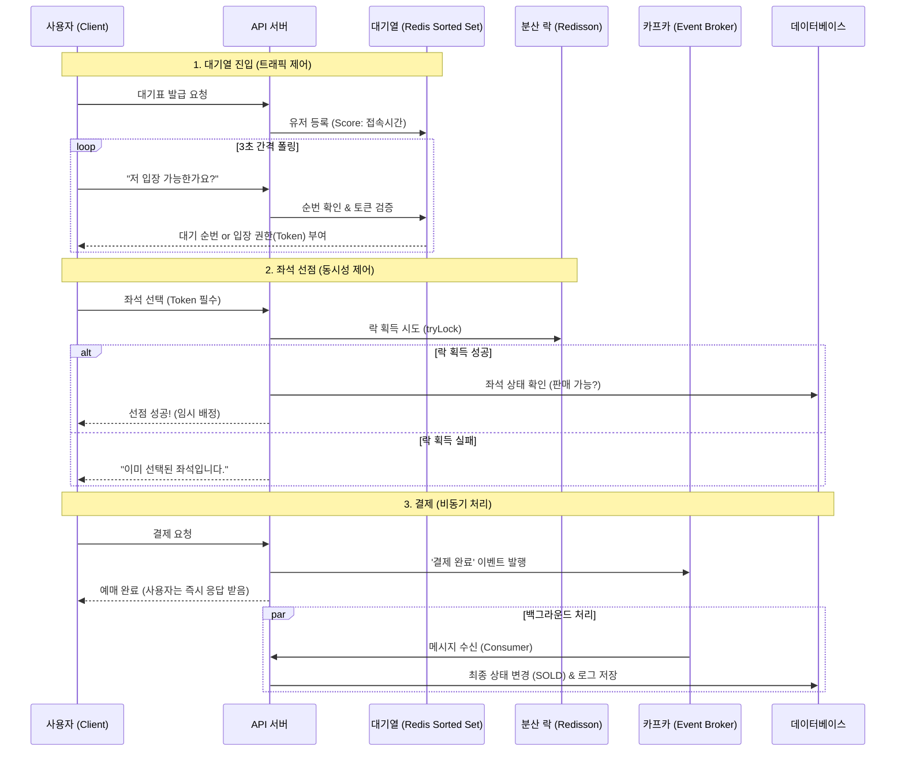
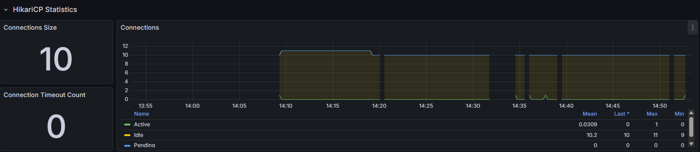
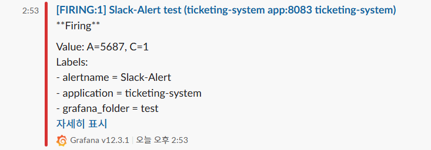
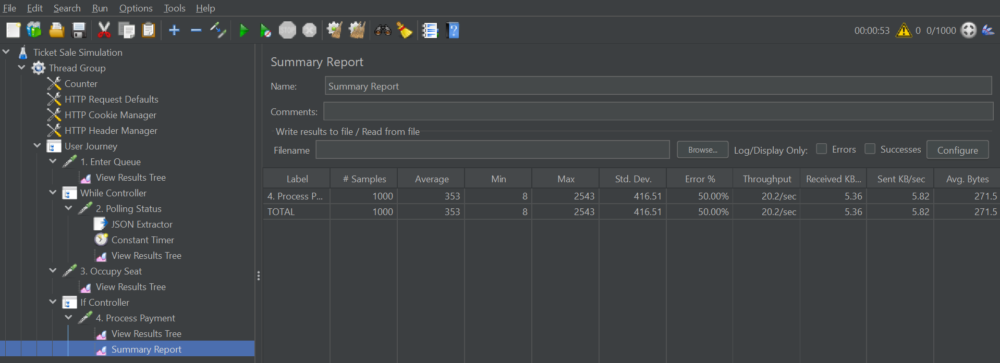

# 대규모 트래픽을 고려한 콘서트 티켓팅 시스템 (High-Concurrency Ticketing Service)

> **"수만 명이 동시에 접속해도 서버가 죽지 않으려면 어떻게 해야 할까?"**
>
> 이 프로젝트는 인기 아이돌 콘서트 예매 상황처럼 **순간적인 트래픽 폭주(Traffic Spike)** 가 발생했을 때, 시스템이 다운되지 않고 공정하게 좌석을 판매하는 방법을 고민하며 만든 프로젝트입니다. 단순한 기능 구현보다는 **동시성 제어, 대기열 설계, DB 부하 분산**과 같은 백엔드 아키텍처의 핵심 문제들을 해결하는 데 집중했습니다.

---

## 1. 프로젝트 개요 (Overview)

티켓팅 서비스의 핵심은 **'안정성'** 과 **'데이터 정합성'** 입니다. 접속자가 몰린다고 서버가 뻗어버리거나, 한 좌석이 두 명에게 팔리는 overbooking 현상은 치명적입니다.

이 프로젝트는 실제 프로덕션 환경을 가정하여 다음과 같은 목표를 달성했습니다.
1.  **서버 보호**: 접속자가 아무리 많아도 DB가 감당할 수 있는 만큼만 들여보내는 **대기열 시스템** 구축
2.  **데이터 무결성**: 0.001초 차이의 동시 클릭 상황에서도 **단 한 명만 결제**되도록 보장 (Redis 분산 락)
3.  **성능 최적화**: 결제 로직이 느려져도 사용자 경험을 해치지 않도록 **Kafka 기반 비동기 처리** 도입

**개발 기간**: 2026.01.07 ~

---

## 2. 기술 스택 (Tech Stack)

### Backend & Database


### Middleware & Infrastructure


### Monitoring & Testing


---

## 3. 시스템 아키텍처 (Architecture)

트래픽을 앞단(Redis)에서 제어하고, 무거운 쓰기 작업(Write)은 뒤로 미루는(Kafka) 구조를 택했습니다.


---

## 4. 핵심 기술적 도전과 해결 과정 (Challenges & Solutions)

### ① 서버가 터지는 것을 막아라: Redis 대기열 시스템
**[예상 문제 상황]**
티켓 오픈 직후 수만 명의 요청이 동시에 DB 조회(SELECT)를 시도하면, DB Connection Pool이 순식간에 고갈되어 서버가 멈추는 현상이 예상되었습니다.

**[대안]**
"우리 서버가 1초에 처리할 수 있는 인원이 100명이라면, 딱 100명만 들여보내자"는 생각으로 **Redis Sorted Set**을 이용한 대기열을 구현했습니다.
* 모든 요청을 일단 Redis에 줄 세우고(Score=타임스탬프),
* 스케줄러가 1초마다 정해진 인원만큼만 **입장 토큰(Access Token)** 을 발급합니다.
* 이 토큰이 없는 요청은 인터셉터(Interceptor) 단계에서 즉시 차단되어 비즈니스 로직에 접근조차 못 하게 막았습니다.

**[결과]**
JMeter 부하 테스트 결과, 동시 접속자가 늘어나도 **DB CPU 사용률은 안정적(40% 미만)**으로 유지되었습니다.

### ② 중복 예매를 막아라: Redisson 분산 락
**[예상 문제 상황]**
사용자 A와 B가 동시에 같은 좌석을 눌렀을 때, 아주 미세한 차이로 두 명 다 예매가 성공하는 **동시성 이슈(Race Condition)** 가 발생할 것이라고 예상했습니다. `synchronized`는 서버가 여러 대일 때(Scale-out) 무용지물이었고, DB 락(Pessimistic Lock)은 속도가 너무 느렸습니다.

**[대안]**
Redis 기반의 **Redisson 분산 락**을 도입했습니다.
* 단순 스핀 락(Spin Lock) 방식인 Lettuce 대신, **Pub/Sub 방식**인 Redisson을 사용하여 락 획득 대기 중인 Redis의 부하를 줄였습니다.
* `tryLock(0, 5min)` 설정을 통해, 누군가 이미 락을 잡고 있다면 **대기하지 않고 즉시 '이미 선택된 좌석'이라는 에러를 반환**하여 사용자 경험(Fast-Fail)을 개선했습니다.

### ③ 결제 속도를 높여라: Kafka 비동기 처리
**[예상 문제 상황]**
결제 과정에서 외부 PG사 연동이나 로깅 로직이 포함되면서 트랜잭션이 길어졌고, 이로 인해 사용자가 오래 기다리는 현상 줄이고 싶었습니다.

**[대안]**
결제의 핵심인 '접수'와 후속 작업인 'DB 반영'을 분리했습니다.
* 서버는 결제 요청을 받으면 **Kafka에 이벤트를 발행하고 즉시 '성공' 응답**을 보냅니다.
* 실제 DB 업데이트는 별도의 Consumer가 백그라운드에서 처리합니다. (Write-Behind 패턴)
* 이를 통해 사용자 체감 응답 시간을 획기적으로 단축했습니다.

---

## 5. 성능 테스트 및 모니터링 (Performance & Monitoring)

실제 장애 상황을 대비하기 위해 JMeter를 이용한 부하 테스트를 진행하고, Grafana와 Slack으로 모니터링 환경을 구축했습니다.

### 1. 트래픽 스파이크 관측 (Grafana)

* **상황**: JMeter로 순간적인 트래픽 폭주를 발생시켰을 때, `custom_queue_size` 메트릭이 급격히 치솟는 것을 실시간으로 확인했습니다.
* **분석**: 대기열 시스템이 없었다면 이 요청들이 모두 DB를 강타했겠지만, Redis가 앞단에서 트래픽을 모두 흡수하여 버퍼링하고 있음을 보여줍니다.

### 2. 임계치 기반 알람 (Slack Alert)

* **대응**: 대기열 사이즈가 설정된 임계치를 초과하자마자 즉시 Slack으로 **[Firing]** 알람이 도착했습니다.
* **의의**: 개발자가 24시간 모니터를 보고 있지 않아도, 시스템 이상 징후를 즉시 파악하고 대응할 수 있는 환경을 마련했습니다.

### 3. 테스트 최종 결과 (JMeter)

* **시나리오**: 1,000명의 유저 동시 접속 (500개 좌석 예매)
* **결과**:
  * **비즈니스 성공률**: 50% (1,000명 중 500명 예매 성공, 나머지 500명은 '매진' 응답 정상 수신)
  * **시스템 안정성**: HTTP 500 에러 0% (서버 다운 없음)
  * **데이터 정합성**: Overbooking 0건 (정확히 500석 판매)
  * **안정성**: 대기열 시스템 도입 후 DB Connection Pool 고갈 현상 해결

---

### 운영을 위한 고민들 (DevOps)
1.  **JVM 튜닝**: 도커 컨테이너 안에서 자바가 메모리를 제대로 인식하지 못해 죽는(OOM) 문제를 겪고, `-XX:MaxRAMPercentage=75.0` 옵션을 추가해 해결했습니다.
2.  **멱등성(Idempotency)**: 네트워크 지연으로 결제 버튼을 두 번 누른 사용자의 중복 결제를 막기 위해, 요청마다 고유한 `Key`를 부여하고 Redis로 중복 여부를 체크했습니다.
3.  **매크로 방지**: Redisson RateLimiter를 사용해 1분당 과도한 요청을 보내는 IP를 차단했습니다.

---

## 6. 실행 방법 (How to Run)

로컬 환경에서 Docker만 있으면 바로 실행해 볼 수 있습니다.

```bash
# 1. 프로젝트 클론
git clone [https://github.com/yunnhho/ticketing-system.git](https://github.com/yunnhho/ticketing-system.git)

# 2. 컨테이너 실행 (App, DB, Redis, Kafka가 한 번에 뜹니다)
# .env 파일 개인 설정 후 실행
docker-compose up -d --build

# 3. 로그 확인
docker logs -f ticketing-app
```

* 메인 접속: http://localhost:8083/concerts
* 관리자 대시보드: http://localhost:8083/admin/dashboard